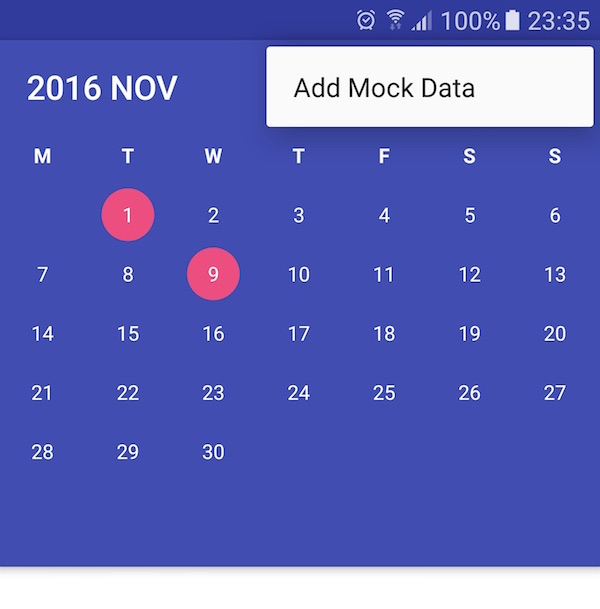
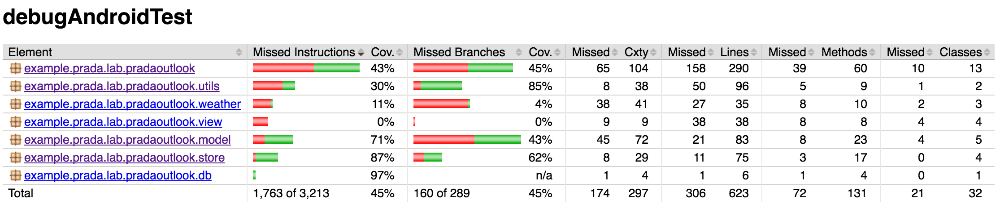

# PradaCalendar

screen record : https://www.youtube.com/watch?v=pGtKCOC01aI

## Import Test Data

You can insert the mock data from the button on the toolbar.



## Test Case

The unit tests can run through Android Studio or the command line, Hint : you need to connect an android phone

```
./gradlew connectedCheck
```

The report page locates at folder `app/build/reports/androidTests`

Note : I also integrate the code coverage report called Jacoco. but it's only working with the rooted devices or emulators. the report will look like


