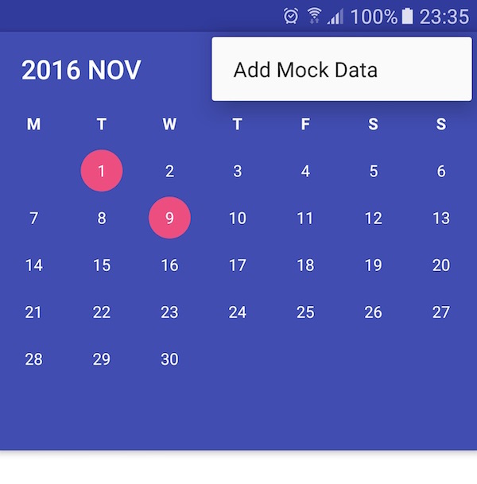
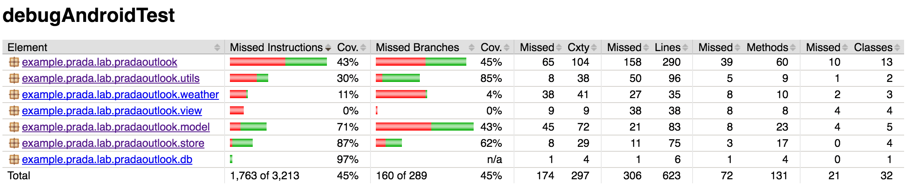

# PradaCalendar

screen record : https://www.youtube.com/watch?v=pGtKCOC01aI

## Build

Use JDK 17 or 21 and Android SDK Platform 35 (with Build Tools 35.0.0).
Set `ANDROID_HOME` to your SDK directory, or set `sdk.dir` in `local.properties`.

```sh
./gradlew build
```

The build uses Gradle 8.11.1 and Android Gradle Plugin 8.9.2. APKs are written to
`app/build/outputs/apk/`. Google Maven and Maven Central provide dependencies;
the JCenter archive at Aliyun is restricted to the legacy stickyheaders artifact.
The app retains target SDK 24 to preserve its runtime behavior. Its expired target
SDK is reported as a lint warning; publishing to Google Play requires a separate
target SDK migration. Other lint errors still fail the build.

## Import Test Data

You can insert the mock data from the button on the toolbar.



## Test Case

The unit tests can run through Android Studio or the command line, Hint : you need to connect an android phone

```
./gradlew connectedCheck
```

The report page locates at folder `app/build/reports/androidTests`

Debug instrumentation coverage uses the Android Gradle plugin's built-in JaCoCo support.
Run `./gradlew createDebugCoverageReport` with a connected device or emulator.
Reports are written under `app/build/reports/coverage/`. Example report:


